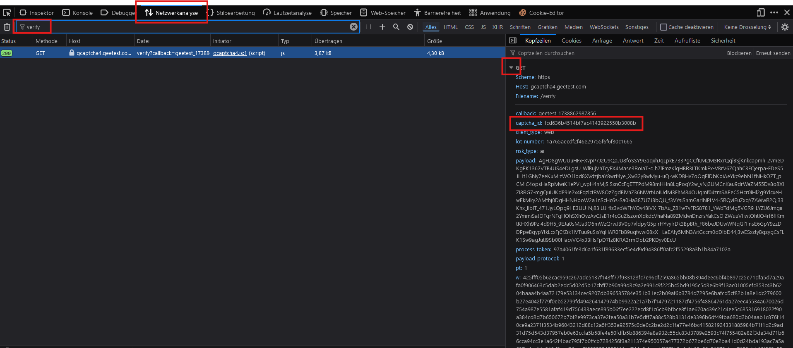

# Geetest v4 solver
<div>
    
    <br>
    
</div>

# ⭐️ star the repo
please star the repo to show support❤️


## Captcha ID
Obtaining the Captcha ID & risk type is simple.
1. Open dev tools `(Ctr + shift + I)`
2. Click on the Network tab
3. Solve the captcha
4. Filter for `verify`
5. Click on the request that is showing up and then on the little arrow left to `GET`
6. Copy the captcha_id & risk_type param



## Installation
```
copy the geeked folder, then import Geeked from geeked
```

## Example Usage

```python
from geeked import Geeked

captcha_id = "54088bb07d2df3c46b79f80300b0abbe"

geeked = Geeked(captcha_id, risk_type="slide")
sec_code = geeked.solve()

print(sec_code)
```

## Contributing

Contributions are welcome! Please feel free to submit a Pull Request. Here are some ways you can contribute:

- 🐛 Report bugs
- ✨ Request features
- 📝 Improve documentation
- 🔧 Submit bug fixes
- 🎨 Add examples

## License

This project is licensed under the MIT License - see the [LICENSE](LICENSE) file for details.

## Disclaimer

This package is unofficial and not affiliated with WUHAN JIYI NETWORK TECHNOLOGY CO., LTD. Use it responsibly and in accordance with WUHAN JIYI NETWORK TECHNOLOGY CO., LTD.'s terms of service.
